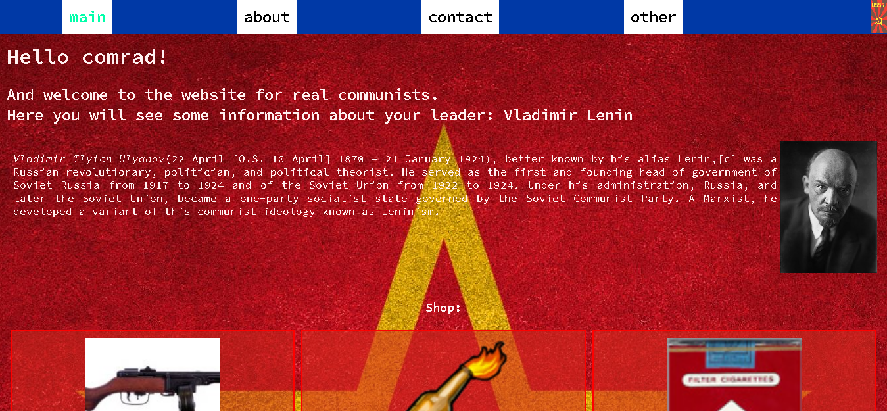

# my_react_resume_website(old version)

## Static page for displaying comrades information

## This is just my attemp to test some React.js functionality on "real" project.

### Still a Development server

### Available <a href='http://ec2-3-141-45-250.us-east-2.compute.amazonaws.com:3000/' target='_blank'>here</a>

#### Some functions and libraries used

<ul>
<li>React Component class</li>
<li>React Hooks</li>
<li>Redux state management library</li>
<li>Requests to the Django REST framework</li>
</ul>

### Screenshot:



## Run & Install

```bash
npm install

npm start
```
